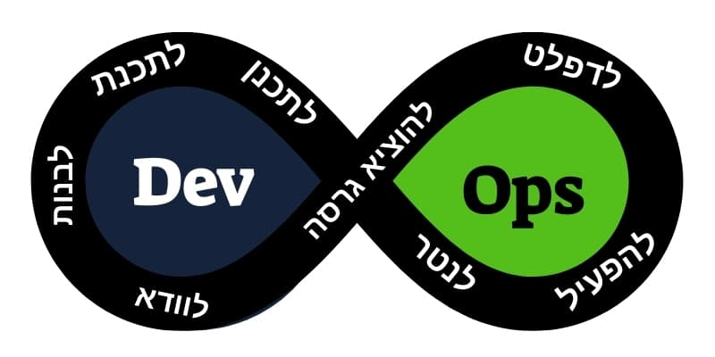

 

              
 <h1 align="center">Devops Basic ORT</h1>
 
Denis Tu Feb, 2022

 

## 🔧 Technologies & Tools

---

### **<kbd>CTRL</kbd> + click to open in new window**

## 1. [Linux Basic commands](https://github.com/DmarshalTU/devops_ort/blob/main/wiki/linux.md)
## 2. [Docker](https://github.com/DmarshalTU/devops_ort/blob/main/wiki/docker.md)
## 3. [Docker-Compose](https://github.com/DmarshalTU/devops_ort/blob/main/wiki/Compose.md)

 
# Next Topic will be updated after the lesson.
